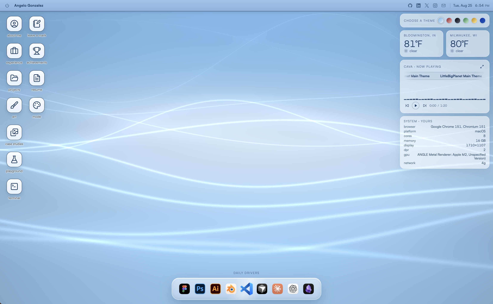
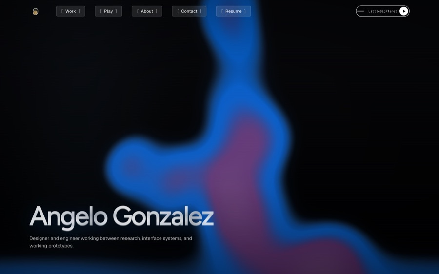
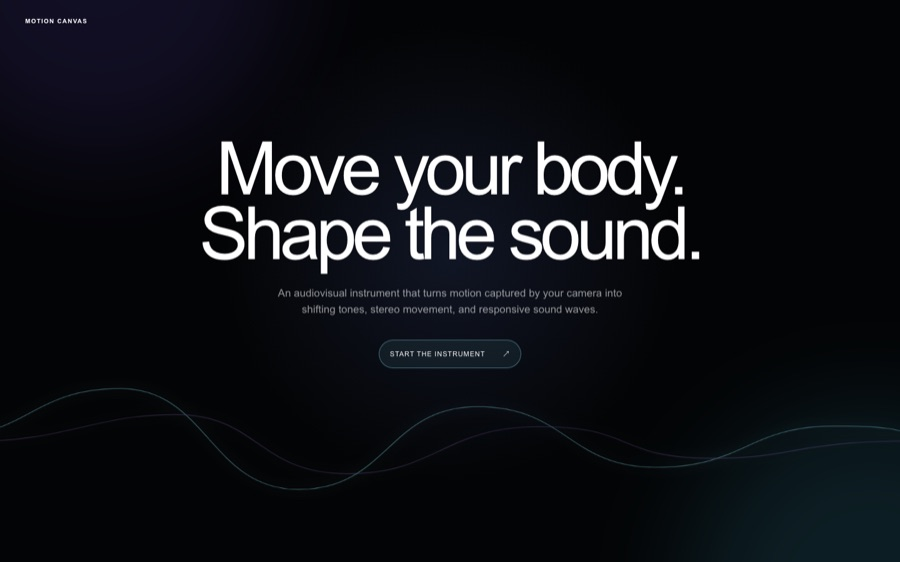
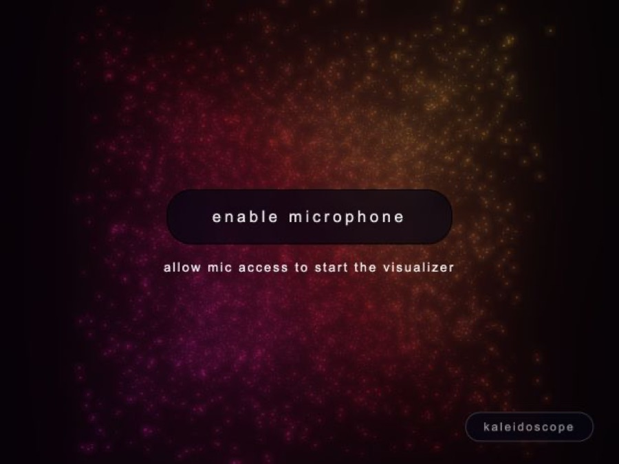
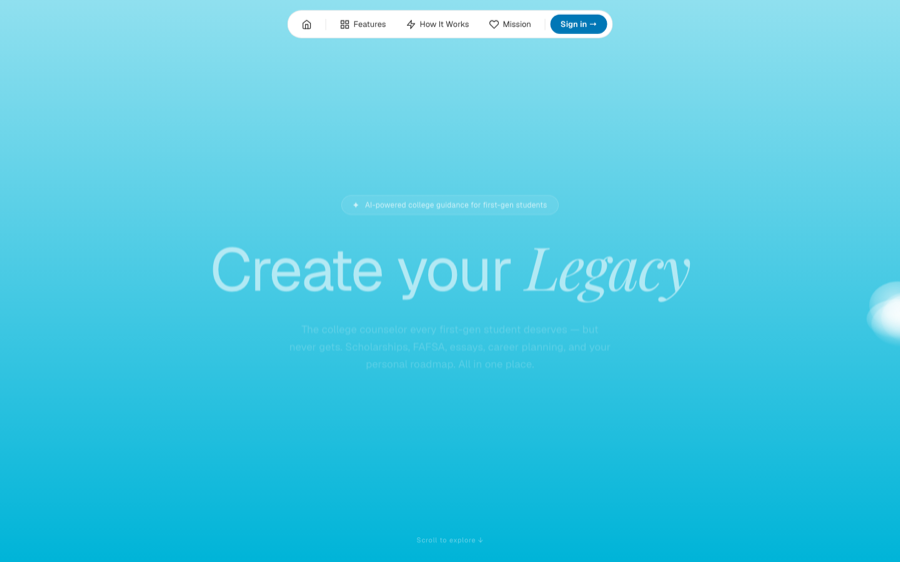
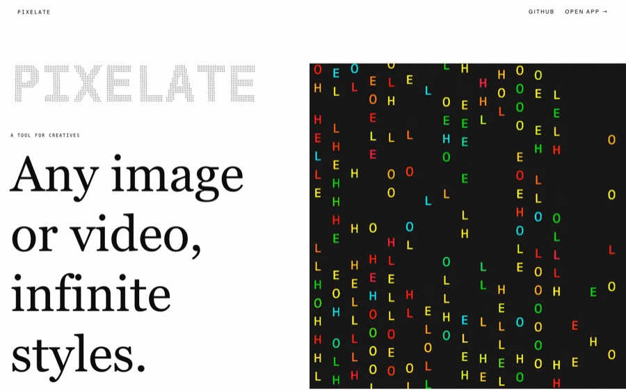
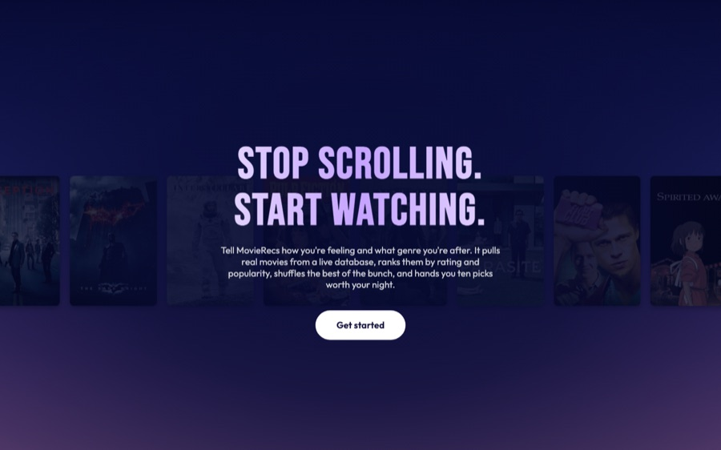
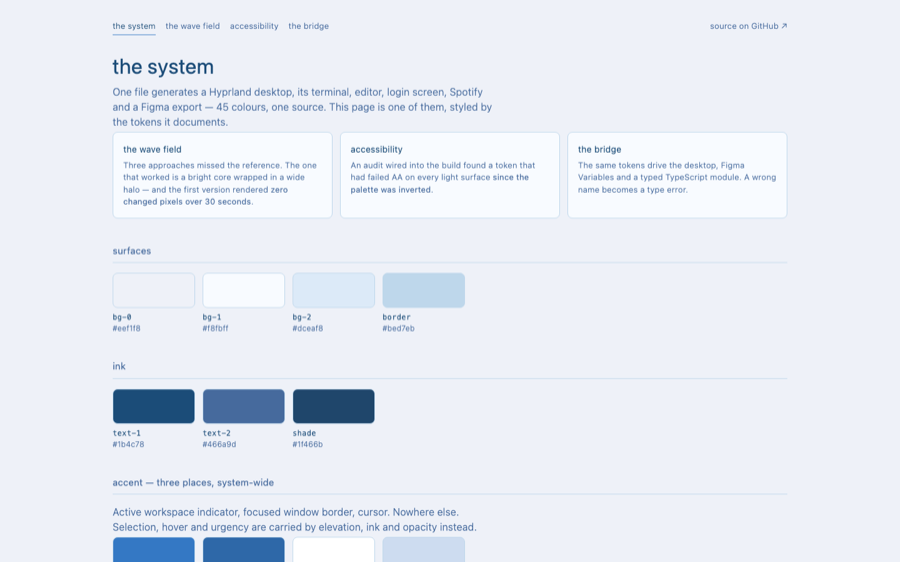

<h1>Hola, Soy Angelo! 👋</h1>

I’m a design engineer? I like to build unique systems with a focus on user experience and interface design. Currently studying Informatics at IU Bloomington with a specialization in Web Design & Development.

**Portfolio:** [angelogonza.com](https://angelogonza.com) · **Email:** [angeloagonza@gmail.com](mailto:angeloagonza@gmail.com) · **LinkedIn:** [angelo-gonza](https://linkedin.com/in/angelo-gonza)

---

## Featured Work

<table>
<tr>
<td width="50%" valign="top">

### [GeloOS →](https://angelogonza.com)

A portfolio that boots like an operating system. Draggable windows, a WebGL2 XMB wave field with six palettes, a magnifying dock, live weather, a music player, a lock screen, achievements, and a shared visitor wall.

`Next.js 16` `React 19` `TypeScript` `WebGL2 / GLSL` `Upstash Redis`

</td>
<td width="50%" valign="top">

### Design Portfolio

The other half of the same site — a shader-led hero, animated page transitions, a Work/Play landing page, a Three.js helix gallery, and long-form UX case studies (FridgeMate, Rideshare Redesign).

`Next.js 16` `Framer Motion` `GSAP` `Three.js` `Tailwind 4`

</td>
</tr>
<tr>
<td width="50%" valign="top">

### [Motion Canvas →](https://motion-canvas-seven.vercel.app/)

A camera-led audiovisual instrument. Your movement becomes light, harmony, and rhythm — shifting tones, stereo movement, and responsive sound waves.

[Live demo](https://motion-canvas-seven.vercel.app/) · [Source](https://github.com/gelogonza/motion-canvas)

</td>
<td width="50%" valign="top">

### [PointVis →](https://pointvis.vercel.app/)

A microphone-reactive point-cloud visualizer for music and sound. Six modes — flow field, kaleidoscope, and more — driven by mic or tab audio.

[Live demo](https://pointvis.vercel.app/) · [Source](https://github.com/gelogonza/visualizer)

</td>
</tr>
<tr>
<td width="50%" valign="top">

### [Legacy →](https://trylegacy.tech)

AI college guidance for first-generation and low-income students — scholarships, FAFSA, essays, and career planning in one roadmap. Built at a hackathon.

[Live product](https://trylegacy.tech) · [▶ Watch demo](https://www.youtube.com/watch?v=TbrLBUcwK1Y) · [Source](https://github.com/gelogonza/legacy)

</td>
<td width="50%" valign="top">

### [Pixelate →](https://pixelate-seven.vercel.app)

A creative-coding tool that turns any image or video into pixel, ASCII, and halftone studies in the browser.

[Live demo](https://pixelate-seven.vercel.app) · [Source](https://github.com/gelogonza/pixelate)

</td>
</tr>
<tr>
<td width="50%" valign="top">

### [MovieRecs →](https://movie-app-nu-hazel.vercel.app/)

Mood-first movie discovery. Tell it how you're feeling and it pulls, ranks, and shuffles ten picks worth your night from TMDB.

[Live demo](https://movie-app-nu-hazel.vercel.app/) · [Source](https://github.com/gelogonza/movie-app)

</td>
<td width="50%" valign="top">

### [Linux Dotfiles →](https://gelogonza.github.io/dotfiles/)

One source of 45 colours generates 84 files across 14 system surfaces — a Hyprland desktop, its terminal, editor, login screen, and a Figma export.

[Read the system](https://gelogonza.github.io/dotfiles/) · [Source](https://github.com/gelogonza/dotfiles)

</td>
</tr>
</table>

---

## More Projects

| Project | What it is | Links |
|---|---|---|
| **Mood Music** | An applied-AI system that recommends music from how you describe your mood | [▶ Watch demo](https://www.loom.com/share/867a1cea0d5647d38bb3d1bcf8830fd9) · [Source](https://github.com/gelogonza/applied-ai-system-project) |
| **Syro** | A cleaner Spotify client — "your music, beautifully simple" | [Live](https://syro-app.vercel.app/) · [Source](https://github.com/gelogonza/SyroApp) |
| **digi** | A digital experiment built on Next.js | [Live](https://digi-beige-gamma.vercel.app) · [Source](https://github.com/gelogonza/digi) |
| **tiny-pond** | A seeded Three.js ecosystem — evolving creatures, god-mode interactions, procedural audio, shader-driven water | [Source](https://github.com/gelogonza/tiny-pond) |
| **desktop-pet** | A local-first macOS desktop virtual pet with five animated pixel anomaly species | [Source](https://github.com/gelogonza/desktop-pet) |
| **OpenAlgo** | Open-source contribution to an algorithmic trading platform | [PR #1485](https://github.com/marketcalls/openalgo/pull/1485) |
| **FitnessTracker** | A CLI fitness tracker written in C++ | [Source](https://github.com/gelogonza/FitnessTracker) |
| **AngeloLink** | A minimal link-in-bio page | [Source](https://github.com/gelogonza/AngeloLink) |

---

## Toolkit

**Languages:** Python, JavaScript, C++, Java, Typescript, HTML/CSS, SQL, PHP

**Frameworks & Tools:** React, Node.js, Express, Django, Flask, FastAPI, Next.js, Tailwind CSS

**Creative Tools:** Figma, Blender, Paper, Miro, Framer, Adobe Creative Suite(Ps, Ae, Ai), Lovable

**Cloud & Infra:** AWS, GCP

-----

